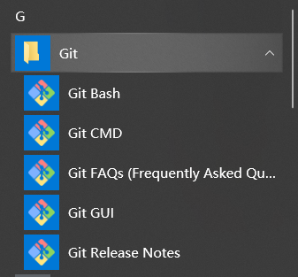

## 版本控制

**版本控制是指对软件开发过程中各种程序代码、配置文件及说明文档等文件变更的管理，是软件配置管理的核心思想之一。**


## Git的安装

官网：https://git-scm.com/


**官网速度慢可以使用淘宝镜像**：http://npm.taobao.org/mirrors/git-for-windows


安装成功，目录显示Git相关的应用程序




## Git相关配置

> Git系统配置

```bash
# 查看配置
git config -l

# 查看系统配置，除去自定义配置
git config --system --list

# 查看用户自定义的配置
git config --global --list
```

Git相关配置文件：

1）、Git\etc\gitconfig : Git安装目录下的gitconfig   --system  系统级

2）、C:\Users\TRacy\\.gitconfig : 只使用于当前登录的用户的基本配置   --global   全局

也可以直接编辑文件，通过命令设置会响应到这里。

>  Git用户配置

**设置用户名和邮箱（必要）**

```bash
# 设置用户名
git config --global user.name "username"

# 设置邮箱
git config --global user.email "youremail"

```


## Git基本原理

> 工作区域

Git本地有三个工作区域：工作目录（Work Dictionary），暂存区（Stage/index），资源库（Repository）。如果加上远程的Git仓库（Remote Dictionary）就可以划分为四个工作区域。文件在这四个区域间的转化关系如下：


工作区：平时存放代码的地方。

暂存区：用于临时存放一些改动，可以保存即将提交到文件列表里的信息。

仓库区（本地库）：安全存放数据的位置，里面有提交的所有版本的数据。其中HEAD指向最新放入仓库的版本。

远程仓库：托管代码的服务器，可以进行远程的数据交换。


> 工作流程

Git的工作流程：

1、创建本地仓库。

2、在工作目录中添加/修改文件。

3、将需要进行版本管理的文件放入暂存区域。

4、将暂存区的内容提交到git本地仓库。

5、将本地仓库的代码推送至远程仓库。


## Git项目搭建

> 本地仓库搭建

1、建立全新的项目，使用git管理的项目的根目录执行

```shell
# 在当前目录新建一个Git代码库
$ git init
```

2、执行完毕后可以看到在根目录下多出了一个.git目录，关于版本的所有信息都在这个目录下。


> 克隆远程仓库

另一种方式是克隆远程仓库，是将远程服务器上的仓库完全镜像拉取至本地。

1、使用HTTPS URL进行克隆

```shell
# 克隆镜像至本地
$ git clone [url] 
```


2、使用SSH URL进行克隆

①进入用户主目录进入.ssh文件夹（如果没有就创建一个）

进入bash输入命令：

```bash
# 获取本机公钥和私钥
ssh-keygen -t rsa
```

连按三次回车：


②查看生成的id_rsa.pub文件，选中本机的公钥


③在Github中添加创建的公钥并命名


④使用公钥clone项目


## Git文件操作

> 查看文件状态

```shell
# 查看指定文件状态
git status [filename]

# 查看所有文件状态
git status

# 将指定文件添加到暂存区
git add [filename]

# 将所有文件提交到暂存区
git add .

# 提交暂存区的内容到本地仓库，并添加说明 -m 提交信息
git commit -m "message"

# 将文件提交至远程仓库
git push


# 将文件移出暂存区
git restore --staged [filename]

```


## Git冲突解决

**如果不是基于GitHub远程库的最新版本进行修改，则无法推送，必须先进行拉取**

产生错误后对冲突的代码块进行修改，然后提交至远程仓库。


## Git分支

git中分支的常用命令

```bash

# 列出所有本地分支
git branch 

# 列出所有远程分支
git branch -r 

# 新建一个分支，但依然停留在当前分支
git branch [branch-name]

# 新建一个分支，并切换到该分支
git checkout -b [branch]

# 在指定分支提交文件
git push --set-upstream origin dev

# 合并指定分支到当前分支
git merge [branch]

# 删除分支
git branch -d [branch-name]

# 删除远程分支
git push origin --delete [branch-name]
git branch -dr [remote/branch]


```


如果同一个文件在合并时都被修改了则会引起冲突：解决方法是可以修改冲突文件后重新提交。

master主分支应该非常稳定，用来发布新版本，一般情况下不允许在上面工作，工作一般情况在新建的dev环境下，

若要发布，可以将dev分支合并到master上来。


## Git版本控制

> 查看本地库历史版本

```bash
# 查看历史记录
git log 

# 多屏显示控制方式：
# 	空格向下翻页
# 	b 向上翻页
# 	q 退出


# 显示完整的版本号，并且每个版本只打印一行
git log --pretty=oneline

git log --oneline

# 显示部分版本号，以及当前版本指针所指向的位置
git reflog

```

> 前进后退


```bash
# 基于索引值操作【推荐】
git reset --hard [局部索引值]
git reset --hard 890b290

# 使用^符号，只能后退
# 一个^表示后退一步，n个表示后退n步
git reset --hard HEAD^

# 使用~符号，只能后退
# ~后表示后退n步
git reset --hard HEAD~n
```


